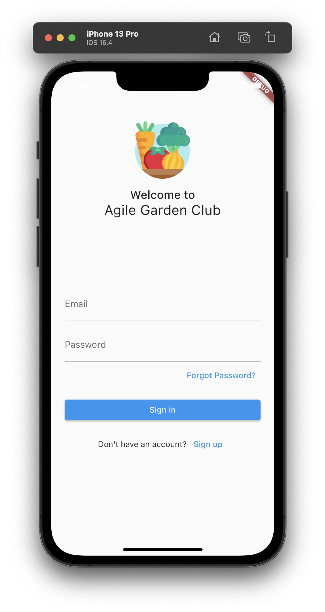
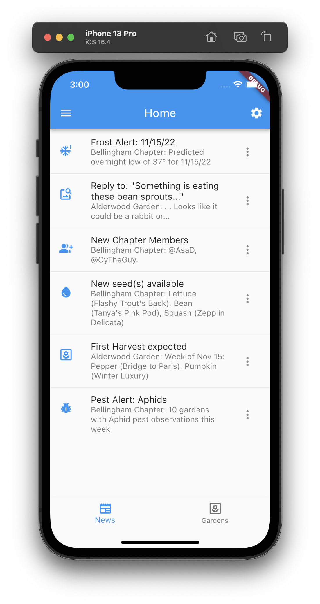
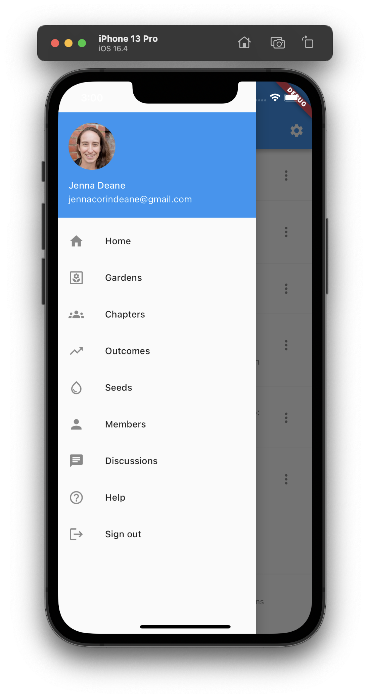
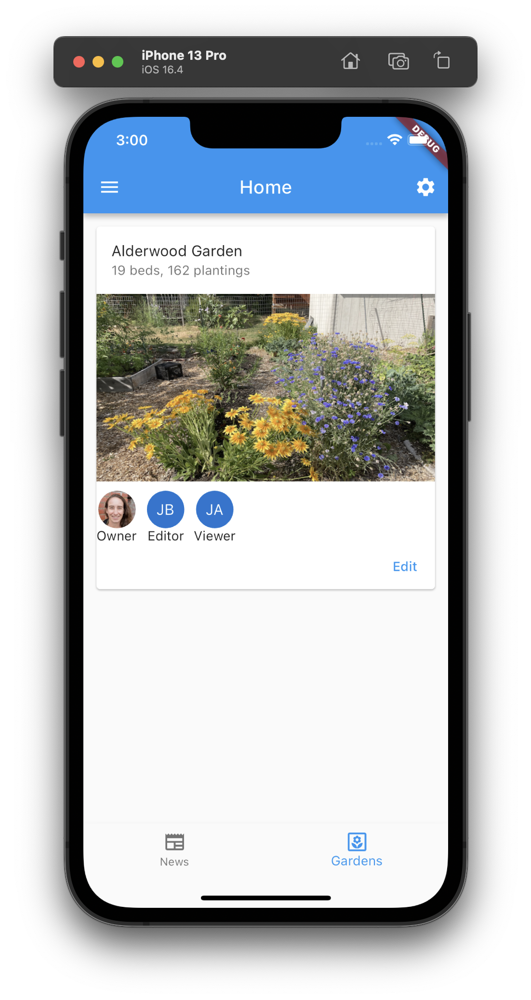
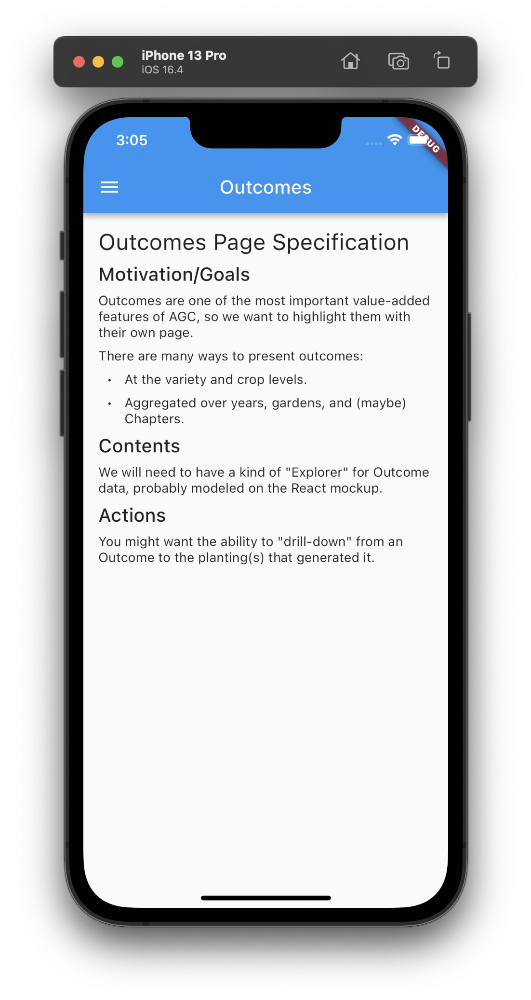

# AGC Mockup (Phase 1)

This mockup is slightly modified from the Flutter Skeleton template app. Differences include:

* Elimination of the src/ directory
* Elimination of localization and restoration mechanisms
* Addition of pages for various garden-related functions

Here are screen shots that illustrate this mockup. We use the flutter_markdown package to provide information on what should appear in a page when we haven't gotten around to actually mocking up the contents.

Click on any screen shot to see it full-size.

  
&nbsp; &nbsp; 
  
&nbsp; &nbsp; 
  

  
  

